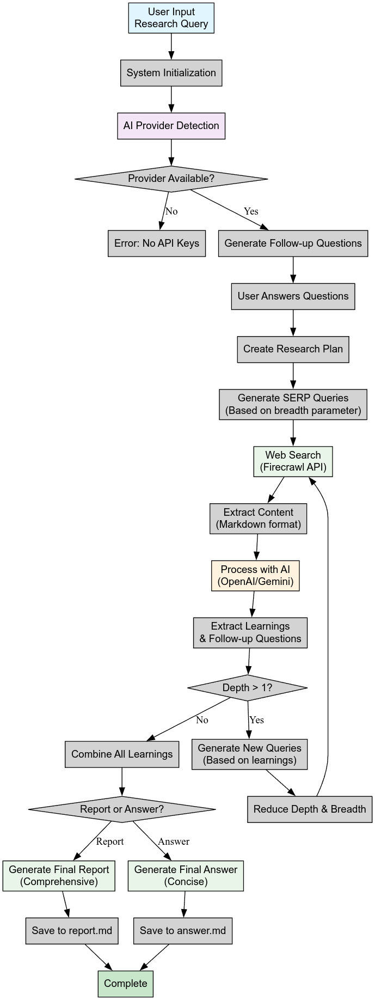

# Deep Research Python

A Python implementation of the AI-powered deep research system that performs iterative research on any topic using search engines and large language models.

## Features

- **Iterative Research**: Performs deep research by recursively generating search queries and diving deeper based on findings
- **Multiple AI Providers**: Supports both OpenAI and Google Gemini APIs
- **Intelligent Query Generation**: Uses LLMs to generate targeted search queries based on research goals
- **Depth & Breadth Control**: Configurable parameters to control research scope
- **Smart Follow-up**: Generates follow-up questions for better research direction
- **Comprehensive Reports**: Produces detailed markdown reports with findings and sources
- **Concurrent Processing**: Handles multiple searches in parallel for efficiency

## Requirements

- Python 3.8+
- OpenAI API key OR Google Gemini API key
- Firecrawl API key

## Quick Start

**🚀 For the fastest setup, see our [QUICKSTART.md](QUICKSTART.md) guide!**

## Installation

1. Clone or download this directory
2. Install dependencies:

```bash
pip install -r requirements.txt
```

3. Set up environment variables by copying `env.example` to `.env`:

```bash
cp env.example .env
```

4. Edit `.env` and add your API keys:

**⚠️ IMPORTANT**: The `.env` file contains sensitive API keys. It's already included in `.gitignore` to prevent accidental commits to version control.

For OpenAI:
```
FIRECRAWL_KEY=your_firecrawl_key_here
OPENAI_KEY=your_openai_key_here
```

For Google Gemini:
```
FIRECRAWL_KEY=your_firecrawl_key_here
GEMINI_KEY=your_gemini_key_here
```

Or both (the system will auto-detect and prefer Gemini if both are available):
```
FIRECRAWL_KEY=your_firecrawl_key_here
OPENAI_KEY=your_openai_key_here
GEMINI_KEY=your_gemini_key_here
AI_PROVIDER=gemini  # Optional: explicitly choose provider
```

## Usage

### Testing Your Setup

Before running research, you can test your AI provider configuration:

```bash
python test_providers.py
```

This will verify that your API keys are properly configured and test the structured output generation.

### Command Line with Topic

```bash
python main.py "artificial intelligence trends 2024"
```

### Interactive Mode

```bash
python main.py
```

You'll be prompted to:
1. Enter your research query
2. Specify research breadth (recommended: 2-10, default: 4)
3. Specify research depth (recommended: 1-5, default: 2)
4. Choose report type (report/answer, default: report)
5. Answer follow-up questions to refine research direction

## How It Works

1. **Query Generation**: Takes user input and generates targeted search queries
2. **Web Search**: Uses Firecrawl API to search and extract content from web pages
3. **Content Analysis**: Processes search results to extract key learnings
4. **Iterative Research**: Recursively explores deeper based on findings
5. **Report Generation**: Compiles findings into comprehensive markdown reports

## System Architecture



### Key Components:

- **🤖 AI Provider**: Automatically detects and uses OpenAI or Gemini APIs
- **🔍 Web Search**: Firecrawl API for comprehensive web content extraction
- **🔄 Iterative Process**: Recursively explores deeper based on initial findings
- **📊 Breadth Control**: Number of parallel search queries per iteration
- **📉 Depth Control**: Number of recursive research iterations
- **📚 Learning Extraction**: AI-powered content analysis and insight generation

## Configuration

### Environment Variables

- `FIRECRAWL_KEY`: Your Firecrawl API key (required)
- `OPENAI_KEY`: Your OpenAI API key (optional, required if not using Gemini)
- `GEMINI_KEY`: Your Google Gemini API key (optional, required if not using OpenAI)
- `AI_PROVIDER`: Explicit AI provider choice ("openai" or "gemini", optional)
- `FIRECRAWL_BASE_URL`: Firecrawl API base URL (optional, default: https://api.firecrawl.dev)
- `CONCURRENCY_LIMIT`: Number of concurrent searches (optional, default: 2)
- `OPENAI_ENDPOINT`: Custom OpenAI endpoint (optional)
- `CUSTOM_MODEL`: Custom model name (optional)

### AI Provider Selection

The system automatically detects which AI provider to use based on available API keys:

1. If `AI_PROVIDER` is set to "openai" or "gemini", it will use that provider (if available)
2. If both keys are available and no explicit provider is set, it will prefer Gemini
3. If only one key is available, it will use that provider

### Supported Models

- **OpenAI**: gpt-4o-mini (default), gpt-4o, gpt-3.5-turbo, and custom models
- **Gemini**: gemini-1.5-flash (default), gemini-1.5-pro, and custom models

### Research Parameters

- **Breadth**: Number of parallel search queries (2-10 recommended)
- **Depth**: Number of recursive research iterations (1-5 recommended)

## Output

The system generates:
- **report.md**: Detailed research report with findings and sources
- **answer.md**: Concise answer (when using answer mode)

## Project Structure

```
python-deep-research/
├── src/
│   ├── __init__.py
│   ├── ai_providers.py      # OpenAI and Gemini integration
│   ├── deep_research.py     # Core research logic
│   ├── feedback.py          # Follow-up question generation
│   ├── firecrawl_client.py  # Web search client
│   └── prompts.py           # AI prompts
├── reports/                 # Generated research reports
├── main.py                  # CLI interface
├── test_providers.py        # AI provider test script
├── requirements.txt         # Dependencies
├── setup.py                 # Package setup script
├── Makefile                 # Build and development commands
├── env.example             # Environment template
├── .gitignore              # Git ignore rules
├── LICENSE                 # MIT license
├── CHANGELOG.md            # Version history
├── CONTRIBUTING.md         # Contribution guidelines
├── QUICKSTART.md           # Quick start guide
└── README.md               # This file
```

## License

MIT License - feel free to use and modify as needed.